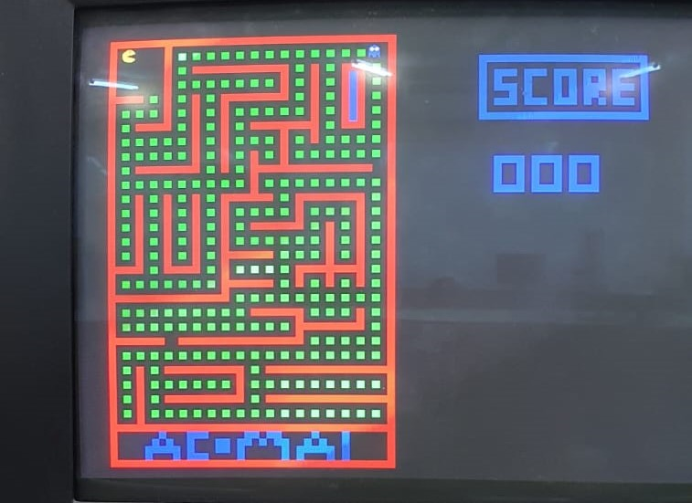
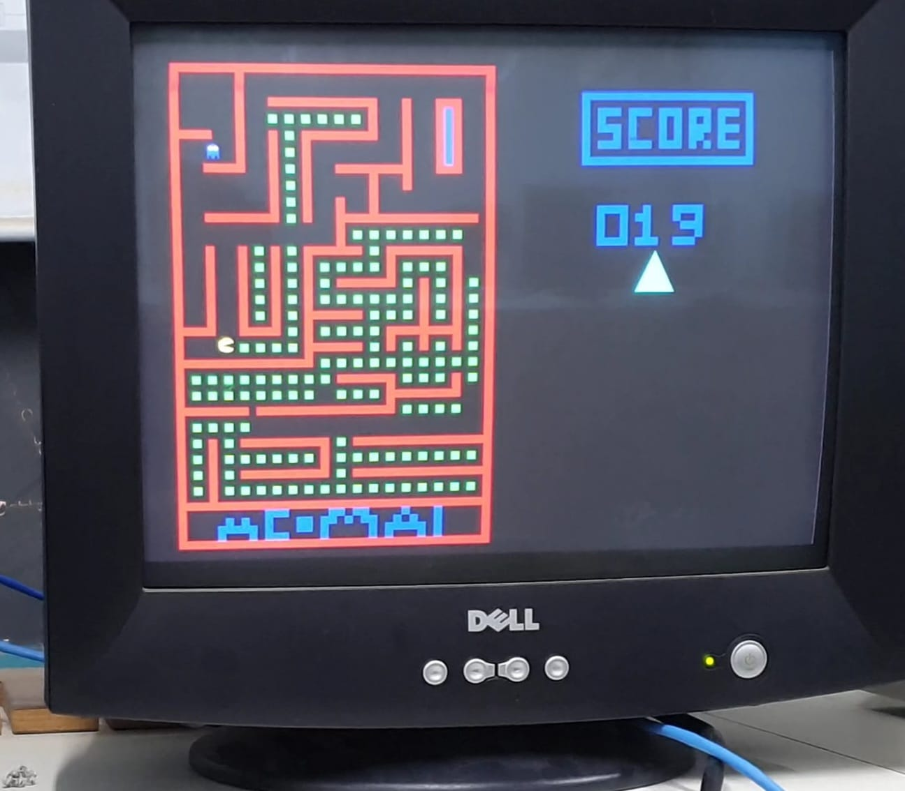
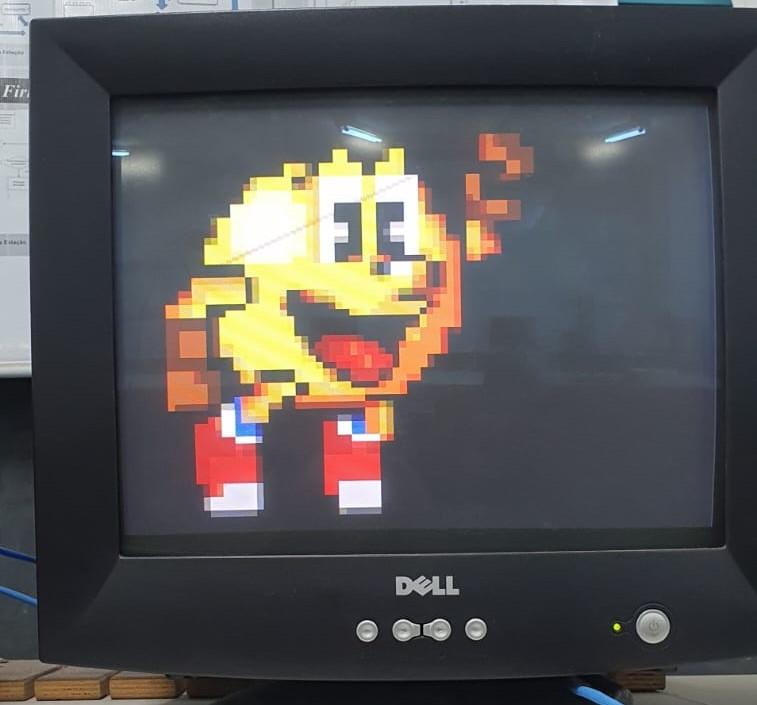
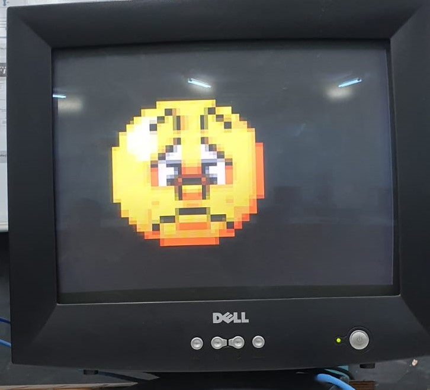

# Sistema Digital
## Problema III - TEC499 - MI Sistemas Digitais - 2024.2 

Professor: Wild Freitas da Silva Santos

Grupo: [Guilherme Ferreira Rocha Lopes](https://github.com/GuilhermeFRLopes), [Thiago Ramon Santos de Jesus](https://github.com/lithiago) e [Ícaro de Souza Gonçalves](https://github.com/icarosg)

## Seções

1. [Introdução](#introdução)
2. [Requisitos do Projeto](#requisitos-do-projeto)
3. [Objetivos](#objetivos)
4. [Descrição das Ferramentas Utilizadas](#descrição-das-ferramentas-utilizadas)
5. [Funcionamento do Jogo](#funcionamento-do-jogo)
5. [Metodologia](#metodologia)
6. [Dificuldades](#dificuldades)
7. [Resultados e Conclusão](#execução-do-jogo)
8. [Referências](#referencias)

## Introdução

Este documento descreve em detalhes o desenvolvimento do jogo Pac-Man. Que Utiliza a linguagem C para implementação lógica e Assembly LEGV7 para construção de uma biblioteca para uso do processador gráfico presente na placa de desenvolvimento modelo [DE1-SoC da terasIC](https://www.terasic.com.tw/cgi-bin/page/archive.pl?Language=English&CategoryNo=167&No=836#contents).

O projeto é o reaproveitamento de um trabalho anterior, no qual foi construída uma biblioteca com funções gráfica que qual abstrai o projeto desenvolvido pelo discente Gabriel Sá Barreto. Em suas atividades de Iniciação Científica e trabalho de conclusão de curso, o estudante projetou e implementou um processador gráfico que permite mover e controlar elementos em um monitor VGA. Durante esse desenvolvimento, o aluno utilizou como unidade principal de processamento o NIOS II, embarcado na mesma FPGA que o processador gráfico.

E

## Requisitos do Projeto

1. O código da biblioteca deve ser escrito em linguagem aseembly;
2. Deverá utilizar todas as funções implementadas na biblioteca
do Processador Gráfico e no mínimo um novo sprite deve ser
colocado na memória e utilizado no jogo;
3. Os dois jogadores devem jogar simultaneamente utilizando
obrigatoriamente o acelerômetro, e adicionalmente o mouse;
4. A variação da velocidade no movimento deve ser refletida na
ação do ator do jogo. Por exemplo, no jogo breakout a barra
se move com velocidade maior se o movimento do mouse for
brusco;
5. Informações do jogo (placar, vidas, etc.) devem na tela do
jogo;
6. O jogo deve permitir ações do usuário através dos botões da
DE1-SoC, no mínimo: a pausa, o retorno, o reinício e o
término do jogo.

    6.1 O usuário poderá parar e reiniciar o jogo em
qualquer momento;
7. Pelo menos dois elementos passivos do jogo deverão se
mover.

## Objetivos
- Aplicar conhecimentos de interação hardware-software;
-  Compreender o mapeamento de memória em uma arquitetura ARM;
-  Utilizar a interface de conexão entre HPS e FPGA da DE1-SoC;
-  Programar em assembly para um processador com arquitetura ARM;
-  Entender políticas de gerenciamento de sistema operacional Linux em arquitetura ARM;
 - Compreender os princípios básicos da arquitetura da plataforma DE1-SoC.
 - Desenvolver um jogo multiplayer

## Descrição das Ferramentas Utilizadas
- Placa de Desenvolvimento: O projeto em questão faz uso de hardware específico para seu desenvolvimento, sendo empregada uma placa de desenvolvimento DE1-SoC da terasIC . Ela é ideal para diversos projetos de prototipagem e desenvolvimento de sistemas embarcados. Ela combina um FPGA Cyclone V SoC da Intel com um processador dual-core ARM Cortex-A9, oferecendo uma plataforma completa e flexível para implementação de hardware e software. Seu acesso para a execução do jogo é feito através da conexão via SSH (ethernet) no terminal de um computador.
- Visual Studio Code: é um editor de código-fonte gratuito e de código aberto desenvolvido pela Microsoft. É multiplataforma, altamente extensível, oferece integração com Git, suporte a várias linguagens de programação, ferramentas de depuração integradas e um terminal incorporado.
- Makefile: Um Makefile é um arquivo de configuração utilizado pela ferramenta make, um utilitário de automação de compilação em sistemas Unix e Linux. Ele descreve como compilar e montar um projeto, especialmente aqueles que envolvem múltiplos arquivos de código-fonte e etapas de compilação complexas
- Github: Uma plataforma de hospedagem de código-fonte e colaboração que utiliza o sistema de controle de versão Git. Ele permite que desenvolvedores gerenciem, compartilhem e trabalhem colaborativamente em projetos de software de forma organizada e eficiente.
- Piskel: Uma ferramenta online de pixelartl que permitiu a modelagem dos sprites utilizados no jogo e do campo.
- Linguagem C: Linguagem de programação em alto nível usada para implementação da lógica do Pacman
- Assembly LegV7: O Assembly LEGv7 é uma linguagem de montagem (assembly) para a arquitetura ARM especificamente baseada no conjunto de instruções ARMv7
- Bibliotecas do Kernel: Para auxiliar no desenvolvimento do código em C do Jogo foram utilizadas as seguintes bibliotecas: Stdio, stdlib, stdint, time, sys/mman, fcntl, Stdbool, unistd, pthread e input.
    1. As bibliotecas Stdio stdlib, stdint, time, Stdbool fornecem funções para diversas tarefas em C, como manipulação de entrada/saída, operações de baixo nível em sistemas Unix-like e tipos booleanos.
    2. sys/mman: Essa biblioteca fornece funções para gerenciamento de memória, especialmente para mapeamento de arquivos ou dispositivos na memória. 
    3. fcntl: Essa biblioteca contém definições relacionadas a arquivos e controladores de entrada/saída.
    4. pthread: Essa biblioteca fornece ferramentas para criar, gerenciar e sincronizar threads dentro de um programa. Importante para funcionamento correto do jogo.
    5. input: um arquivo de cabeçalho do kernel Linux que fornece definições e estruturas relacionadas ao subsistema de entrada do Linux, usado para interagir com dispositivos de entrada, como teclados, mouses, touchpads, gamepads, e outros dispositivos semelhantes.

## Metodologia
Para a realização deste projeto, decidiu-se reaproveitar elementos já desenvolvidos. Foram mantidas as implementações das funções, como o mapeamento de memória e as funções gráficas providas da biblioteca da GPU. 

Posto isso a metodologia irá trazer os conceitos que foram acrescidos em relação ao último projeto.

- **Uso de Threads**: Uma thread é a menor unidade de execução em um processo, representando uma sequência independente de instruções que pode ser agendada e executada pela CPU. Threads compartilham o mesmo espaço de memória e recursos de um processo pai, como variáveis globais e arquivos abertos, mas possuem seu próprio contexto de execução, incluindo registradores e pilha. Isso permite a execução simultânea de múltiplas tarefas dentro de um único processo, promovendo maior eficiência e paralelismo, especialmente em sistemas multicore. O uso de thread foi essencial para leitura contínua do mouse.
- **Processador Gráfico**:
 A implementação gráfica do sistema conta com uma biblioteca dedicada ao processador gráfico, composta por diversas funções essenciais para a construção e manipulação dos elementos visuais do jogo. Dentre essas funções, algumas são fundamentais para definir e atualizar o cenário e os sprites. As funções principais incluem:

    - set_background_block: Configura blocos do background com cores específicas.
    - send_instruction: Envia instruções ao processador gráfico para realizar as operações desejadas.
    - isFull: Verifica se as filas FIFO, responsáveis por armazenar as instruções, estão cheias. 
    
    Além dessas, também foram implementadas outras funções para controle detalhado:

    - set_sprite: Define as propriedades e a posição de um sprite na tela.
    - set_background_color: Configura a cor base do background.
    - set_polygon: Define os parâmetros e o desenho de polígonos, como quadrados e triângulos, que podem ser exibidos junto ao background e aos sprites.

    Também em nível de Assembly, a biblioteca gráfica inclui funções específicas para mapeamento e gerenciamento de memória:

    - createMappingMemory: Inicializa o mapeamento de memória necessário para acessar as instruções e os elementos gráficos.
    - closeMappingMemory: Finaliza e libera o mapeamento de memória.
    - open_button: Função para configurar o mapeamento e o controle de botões de entrada.
    - setPixelSprite: Essa função permitiu a alteração do conteúdo da sprite, com uso da WSM, instrução que modifica o contéudo presente na memória dos sprites.

## Funcionamento do Jogo

O jogo desenvolvido foi o PacMan, um dos jogos de arcade mais icônicos e populares de todos os tempos, criado por Toru Iwatani e lançado pela Namco em 1980. O jogo apresenta o personagem principal, Pac-Man, uma figura redonda e amarela, que deve navegar por um labirinto enquanto consome pontos e evita fantasmas. O objetivo é comer todas as pastilhas no labirinto sem ser pego pelos fantasmas.

    
    
Figura 1: Pacman

- Captura de dados do mouse:
    - Para pode capturar os dados do mouse foi necessário ler o arquivo event0 do linux nele é obtido uma struct que contém as informações sobre o movimento do mouse tanto em relação do eixo X e Y. 
    - Foi implementada uma thread que separa a leitura dos dados do mouse da thread principal. Percebeu-se a necessidade dessa thread durante os testes, nos quais ficou evidente que não era possível manter duas leituras contínuas em uma única thread. A outra leitura é referente ao acelerômetro.
    - A sensibilidade do mouse foi ajustada, já que os dados recebidos inicialmente eram muito instáveis, comprometendo o movimento suave e preciso durante o jogo.
- Captura dos dados do acelerômetro:
    - A captura dos dados do acelerômetro já havia sido implementada em projetos anteriores, onde funcionava perfeitamente em paralelo com a lógica do jogo. Por isso, foi mantida, evitando complicações desnecessárias.
- Movimento dos sprites:
    - Como já mencionado, o movimento é obtido por meio do mouse e do acelerômetro, mas o ponto a ser destacado é como esses dados são utilizados.
        - Os dados recebidos consistiam em valores negativos e positivos, que variavam constantemente. Para lidar com essa variação e garantir um movimento fluido e controlado, foi implementada uma lógica que identifica a direção do movimento com base na tendência de variação desses valores. Isso significa que o sistema observa o histórico das leituras para inferir se o movimento é para a direita, esquerda, cima ou baixo.
        - Os valores recebidos eram em X e Y, representando as mudanças nas coordenadas do mouse ou do acelerômetro. No entanto, para esses dados serem utilizados corretamente no jogo, foi necessário relacioná-los com a posição proporcional à linha e à coluna do tabuleiro. Isso ocorre porque os sprites não estão diretamente posicionados dentro da matriz do tabuleiro, mas se movem com base em coordenadas X e Y absolutas. Essa conversão foi essencial para garantir que o movimento dos sprites se alinhasse com o layout do tabuleiro e não resultasse em deslocamentos fora do esperado.
        - Além disso, a implementação foi projetada para garantir que o movimento seja contínuo e não cause “saltos” ou movimentos abruptos. Isso foi possível através de um ajuste na sensibilidade dos dados, para filtrar valores muito altos ou inconsistentes, que poderiam comprometer a jogabilidade. O sistema então ajusta a posição do sprite com base nas direções determinadas e verifica a presença de colisões antes de fazer qualquer alteração nas coordenadas, evitando que os sprites se movam para áreas inválidas do jogo.
- Campo do Jogo:
    - O campo do jogo foi desenhado a partir da função de setBackgroundBlock que permite desenhar a partir de uma matriz de pixels, o tamanho do campo foi então uma matriz de 60 linhas e 39 colunas. A matriz é composta por binários de 9 bits que cada 3 bits representa o tom de verde, azul ou vermelho a ser desenhado na tela.
    

    
    
Figura 2: Campo do Jogo.

- Elementos Passivos:
    - O campo do jogo acabou se tornando um elemento passivo, no qual as paredes se movem sem a influência de nenhum jogador. O título do jogo também é um elemento passivo. 
    

    
    
Figura 2: Elementos Passivos

- Uso do Poligono:
    - O poligono é um dos componentes disponiveis da biblioteca gráfica e foi usada para ilustrar o score.
    

    
    
Figura 4: Poligono.

## Dificuldades
No primeiro estágio do desenvolvimento, foi estabelecida a implementação lógica do jogo, juntamente com a criação das matrizes de pixels, o que não apresentou grandes dificuldades. Os primeiros testes foram realizados apenas com o sprite do Pac-Man, que se move por meio do acelerômetro, funcionando corretamente. A complexidade surgiu com a introdução do mouse, momento em que o conhecimento sobre o uso de threads se tornou essencial. O desafio de sincronização foi, então, resolvido por meio do estudo da biblioteca `pthread`, que possibilitou um excelente gerenciamento das threads.

## Resultados e Conclusão
O projeto alcançou todos os objetivos e requisitos estabelecidos, possuindo uma biblioteca para um processador gráfico funcional, pertimindo a abstração para que o jogo PacMan pudesse ser implementado. A compreensão sobre, conceitos de arquitetura de computadores foi fundamental para a compreensão da arquitetura ArmV7 e suas instruções, conceitos de Sistemas Operacionais, sobre paginação, sobre threads e endereço físico e virtual também foram fundamentais para a conclusão desse projeto.

Vídeos do funcionamento do jogo nesse (link)[https://drive.google.com/drive/folders/1abpvzVofquZNPs8s74ZJE_rAxwmoYrPl?usp=sharing]

    
    
Figura 3: Tela para vitória do PacMan.

   
    
    
Figura 4: Tela para vitória do Fantasma.

## Referências
[1] Chromium OS Docs, "Syscalls." Accessed Nov. 8, 2024. [Online]. Available: https://chromium.googlesource.com/chromiumos/docs/+/master/constants/syscalls.md

